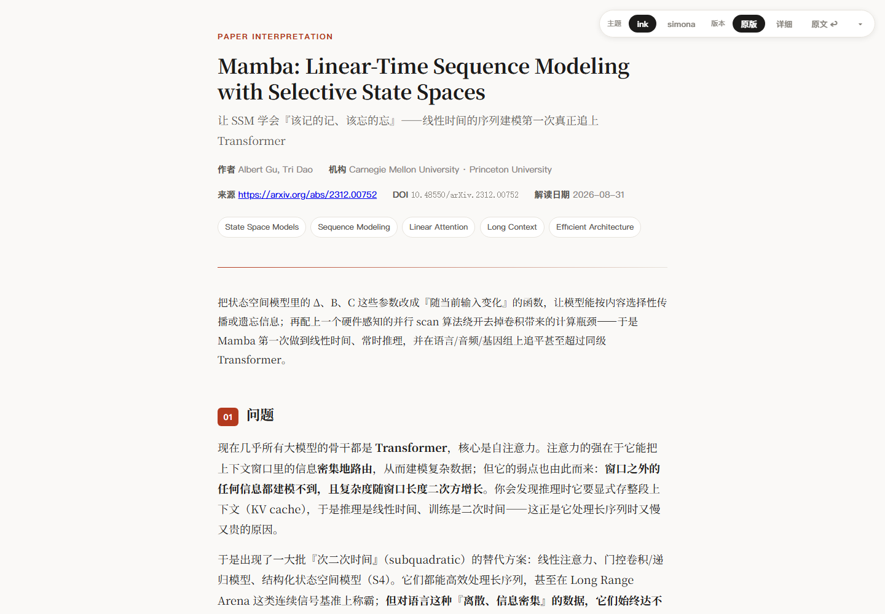
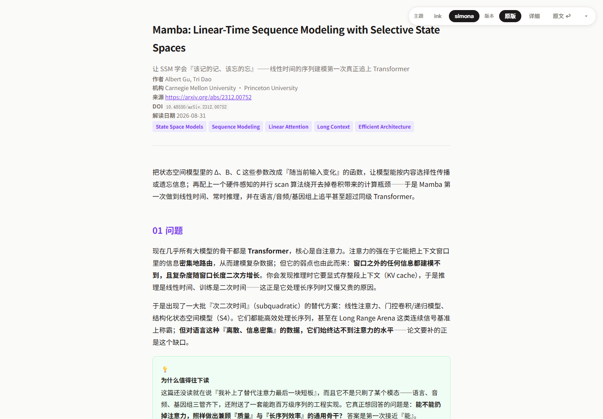
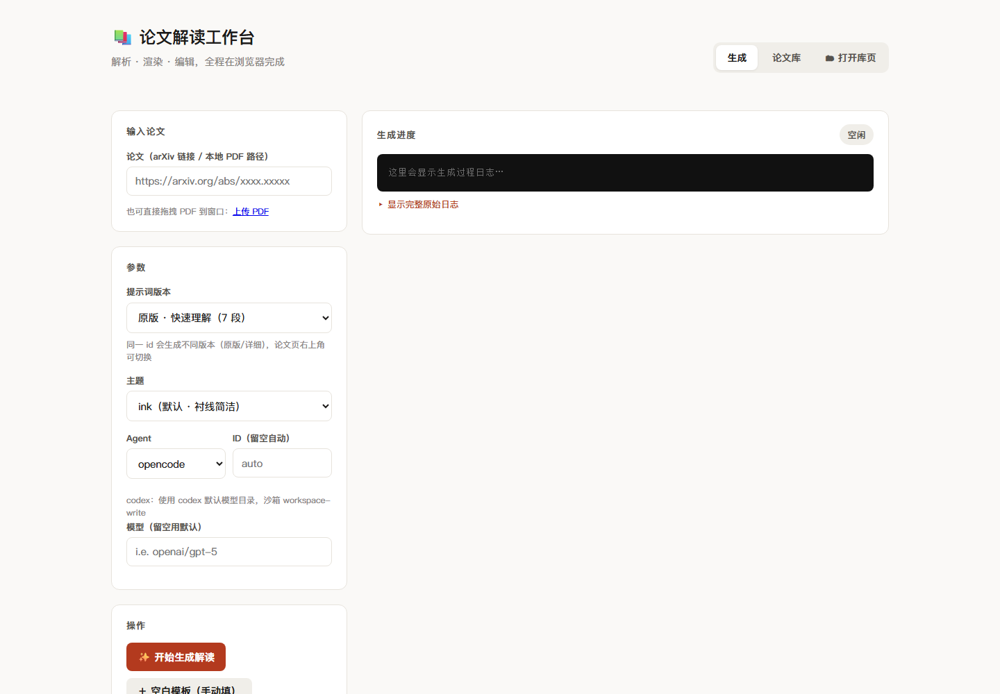

# paper-framework

把论文 PDF 或 arXiv 链接，变成清晰、可切换主题、可追溯原文的阅读网页。

## 两种网页效果

<table>
  <tr>
    <td width="50%" align="center">
      
      <br><sub><b>ink</b> · 克制的衬线阅读版式</sub>
    </td>
    <td width="50%" align="center">
      
      <br><sub><b>simona</b> · 更醒目的信息卡片与强调色</sub>
    </td>
  </tr>
</table>

同一篇解读可在网页右上角即时切换主题与「原版 / 详细」版本，不需要重新生成。

## 工作台操作



粘贴 arXiv 链接或上传 PDF，选择解读版本、主题和 Agent，点击生成；完成后可直接编辑内容、重新渲染并预览。

## 快速开始（Web 版 · 推荐）

```powershell
cd paper-framework
python scripts/webapp.py --open
```

浏览器会打开 `http://127.0.0.1:8000`。整个生成、编辑、预览和论文库管理流程都可以在工作台内完成。

## 主要能力

- 两套提示词：`original` 用于快速理解，`detailed` 提供 15 节科研级解读与原文证据。
- 两套主题：`ink` 与 `simona` 可在论文页内即时切换，并记住选择。
- 两个版本：同一篇论文的「原版 / 详细」解读共用一个入口，互不覆盖。
- 来源追溯：保留原文链接与本地 PDF 入口，关键判断可附 `evidence`。
- 浏览器工作台：生成、实时日志、JSON 编辑、渲染、预览和论文库集中在一个页面。
- 单文件输出：生成的 `papers/<id>/index.html` 可直接双击阅读；图片还可全量内联。

## 目录

```
paper-framework/
├── prompts/          # 两套提示词
│   ├── original.md
│   └── detailed.md
├── AGENTS-usage.md   # opencode/codex 命令、提示词、事件流解析详解
├── content/
│   ├── schema.md                 # content.json 结构说明（含版本/来源）
│   ├── <id>.json                 # 一篇论文的原版解读（默认版本）
│   ├── <id>__detailed.json       # 同一篇论文的详细版（可选）
│   ├── papers.json               # 论文清单（每篇一次，聚合各版本）
│   ├── uploads/<...>.pdf         # 本地原始 PDF（可被论文页打开）
│   └── assets/<id>/<version>/    # 各版本论文原图（可选）
├── template/
│   ├── style.css     # 主题 · ink（默认）
│   └── style.simona.css         # 主题 · simona（复刻原 paper-to-html）
├── scripts/
│   ├── webapp.py     # ★ 浏览器版工作台（生成/编辑/渲染/预览/论文库，无需终端）
│   ├── generate.py   # 调用 opencode/codex 或手动生成 content.json
│   ├── render.py     # content.json → 自包含 index.html（多主题+多版本+来源）
│   ├── serve.py      # 独立静态论文库（可选，默认端口 8020）
│   └── codex_compat.py  # codex 模型目录兼容（补全 cc-switch 缺失字段）
├── web/
│   └── index.html    # Web 工作台前端（单页）
├── papers/<id>/      # 渲染产物（含版本间切换）
└── index.html        # 论文库首页（启动 webapp 或 serve.py 时生成）
```

## 快速开始（CLI 版）

```bash
cd paper-framework

# 1) 用 opencode 生成 content.json（默认原版提示词）
python3 scripts/generate.py --paper "https://arxiv.org/abs/2408.06292" \
    --prompt original --backend opencode

# 2) 渲染成网页
python3 scripts/render.py ai-scientist        # → papers/ai-scientist/index.html

# 3) 本地预览 + 构建论文库首页
python3 scripts/serve.py                      # http://localhost:8020（独立静态版）
```

## 常用用法

### 用 codex 生成

```bash
python3 scripts/generate.py --paper "https://arxiv.org/abs/xxxx.xxxxx" \
    --prompt detailed --backend codex
```

### 手动生成内容

```bash
python3 scripts/generate.py --manual --id my-paper
# 编辑 content/my-paper.json（模板含注释与示例），然后：
python3 scripts/render.py my-paper
```

### 详细版 + 证据可追溯

```bash
python3 scripts/generate.py --paper /path/to/paper.pdf --prompt detailed --backend opencode
```

`detailed` 版会在每个关键判断后附 `evidence` 字段，渲染成灰色「原文依据」小注，
把解读升级为 **AI 解读 + 证据可追溯**。

### 完全单文件（图片转 base64，可离线/邮寄）

```bash
python3 scripts/render.py ai-scientist --inline-assets
```

### 切换主题 / 版本 / 打开原文

```bash
python3 scripts/render.py ai-scientist                     # 默认 ink
python3 scripts/render.py ai-scientist --theme simona      # 原版 simona 主题
```

主题优先级：命令行 `--theme` > `content.json` 的 `theme` 字段 > 默认 `ink`。

> 渲染产物会内嵌全部主题 + 全部版本，论文页右上角浮动栏可：
> - **切换主题**（`ink`/`simona`，即时生效，无需重新渲染）
> - **切换版本**（存在 `<id>__detailed.json` 时显示「原版/详细」）
> - **打开原文**（`source` 网址 → 原文 ↩）或 **本地 PDF**（`source_pdf` → PDF ↩）
> - 点击 `▾` **收起/展开**工具栏（记住选择，localStorage）

## 提示词工具函数

`generate.py` 骨架：

| 参数 | 说明 |
|------|------|
| `--paper` | arXiv 链接或本地 PDF |
| `--prompt` | `original` / `detailed` |
| `--backend` | `opencode` / `codex` / `manual` |
| `--id` | 强制指定目录名（默认从论文推断） |
| `--manual` | 仅生成 content 模板 |
| `--model` | 指定模型（默认用 Agent 配置） |

## 语义组件速查（`content.json` 的 `blocks`）

| 类型 | 用途 |
|------|------|
| `p` `list` | 段落 / 列表（支持 `**加粗**`、`*斜体*`、`$公式$`） |
| `section` `sub` | 章节 / 小节标题 |
| `concept` | 核心概念（title/body/why） |
| `insight` | 核心洞见（竖向引线） |
| `figure` | 论文原图（src/caption/evidence） |
| `formula` | 关键公式（title/tex/note/evidence） |
| `architecture` | 等宽方程流程块（text/evidence，`white-space:pre`） |
| `table` | 结果表（headers/rows/highlights/caption/evidence） |
| `verdict` | 明确判断 |
| `proscons` | 优点 vs 缺点 |
| `review` | 博导审稿（五维 strong/weak/mixed + overall） |
| `callout` | 提示框（info/warn/tip） |
| `takeaway` | 一句话总结 |

完整说明见 `content/schema.md`。

## 依赖

- Python 3（无第三方包，用标准库）
- 可选：`opencode` / `codex` 命令行（用于自动生成）

## codex 兼容说明

若 codex 启动报 `failed to parse model_catalog_json ... missing field base_instructions`（常见于 `cc-switch`
写的模型目录缺字段），本框架启动时（`webapp.py` 或 `generate.py` 任一 codex 调用）会自动：
1. 从 `~/.codex/cc-switch-model-catalog.json` 读出并**补齐缺失字段**，写一份副本到 `.cache/`（不改动原文件）；
2. 通过 `-c model_catalog_json=<副本>` 传给 codex；
3. 以 `codex exec ... --json` 运行，输出 JSONL 事件流，框架据此展示 🧠 思考 / `$ 命令` / ⚠ 出错等实时日志；
4. 沙箱用 `workspace-write`，让 codex 能在项目内直接写 `content/<id>.json`；
5. 附带 `--skip-git-repo-check` 以便在非 git 目录运行。

> 注意：`codex` 的沙箱网络可能无法解析 arXiv 域名（`Could not resolve host`），框架会如实记录到日志；
> 此时可换成 opencode 生成，或等 codex 走浏览器工具。桌面端 codex 不受影响（它用另一份配置）。

## Git 约定（示例论文随库携带，个人论文不入库）

- **示例论文**（`2507-01599v1`、`ai-scientist`、`mamba`、`wanghuang` 及其 `__detailed` 版，共 8 个 JSON）
  随代码库一起提交，clone 下来即可直接渲染阅读。
- **你以后新生成的论文**：`content/*.json` 中**除示例外的一律不进 git**。
  这是通过 `.gitignore` 实现的——默认忽略 `content/*.json`，仅用 `!` 反向保留几个示例文件。

```gitignore
# .gitignore（节选）
content/*.json            # 忽略所有论文解读 JSON
!content/mamba.json       # 反向保留示例……
!content/mamba__detailed.json
# ……其余示例同理
```

效果：
```bash
git status                # 你新增论文后，这里干净，不会看到 content/新增的 json
git add -A                # 也不会把新论文加进 git
```

**如果你想把某篇新论文也入库**（例如作为新的示例分享），两种方式：
1. 在 `.gitignore` 的 `content/*.json` 之后补一行 `!content/你论文的id.json`（以及 `__detailed`）。
2. 或先 `git add -f content/你论文的id.json` 强制加入（推荐用方式 1，更持久）。

> 注：`content/papers.json`（serve.py 生成的索引）已取消跟踪，属生成物；任何人 clone 后运行
> `python3 scripts/serve.py --build-only` 或启动 webapp 即会自动重建。

---

由 opencode 协助搭建。核心思想：**AI 决定信息类型，CSS 决定视觉，证据让解读可信。**
